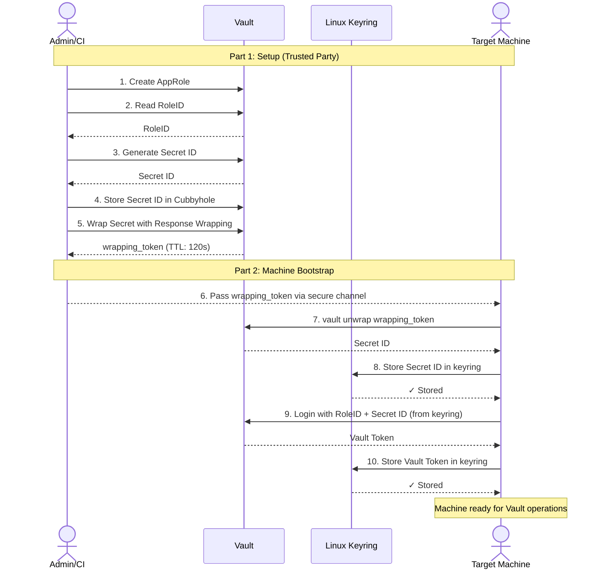

# Machine Encryption with HashiCorp Vault

## Overview

This guide demonstrates a secure workflow for managing machine credentials using HashiCorp Vault's AppRole authentication and Response Wrapping mechanisms combined with Linux Keyring for local secret storage.

### Reference Documentation

- [Best practices for AppRole authentication](https://developer.hashicorp.com/vault/docs/auth/approle/approle-pattern#usage-workflow)
- [Linux Keyring Introduction](https://blog.cloudflare.com/the-linux-kernel-key-retention-service-and-why-you-should-use-it-in-your-next-application/)
- [Secrets Management in Command Line](https://smallstep.com/blog/command-line-secrets/)

### Workflow Diagram



---

## Part 1: Trusted Party (Admin/CI Setup)

This section covers the initial setup performed by a trusted administrator or CI system.

### Step 1.1: Create AppRole

Create a new AppRole with controlled permissions and TTL settings. The AppRole grants limited-lifetime tokens to machines.

```bash
vault write auth/approle/role/my-role \
    token_type=batch \
    secret_id_bound_cidrs="0.0.0.0/0" \
    secret_id_ttl=0 \
    secret_id_num_uses=0 \
    token_ttl=20m \
    token_max_ttl=30m \
    token_num_uses=0 \
    token_policies=my-key-policy \
    token_bound_cidrs="0.0.0.0/0"
```

**Key Settings:**
- `token_ttl=20m` - Token expires after 20 minutes
- `token_max_ttl=30m` - Maximum lifetime cap
- `token_type=batch` - Lightweight, short-lived tokens

For detailed configuration options, see [Vault API Documentation](https://developer.hashicorp.com/vault/api-docs/auth/approle#create-update-approle).

In addition, the `my-key-policy` vault policy must exist and contain at least the following entries:
```bash
path "transit/encrypt/my-transit-key" {
  capabilities = ["create", "update"]
}

path "transit/decrypt/my-transit-key" {
  capabilities = ["create", "update"]
}
```
where `my-transit-key` is the encryption/decryption key in the vault transit engine.

### Step 1.2: Retrieve RoleID

Extract the RoleID (stable identifier for the AppRole):

```bash
vault read auth/approle/role/my-role/role-id
```

### Step 1.3: Generate Secret ID

Create a Secret ID (acts as a password for this particular authentication):

```bash
vault write -f auth/approle/role/my-role/secret-id
```

### Step 1.4: Store Secret in Cubbyhole with Response Wrapping

The Cubbyhole and Response Wrapping provide the secure channel for delivering the Secret ID to the machine.

**Understanding Cubbyhole:**
The `cubbyhole` secret engine in Vault is token-bound, meaning each token has its own isolated storage space. Secrets stored here are completely private to the token that created them—no other token can access them, providing strong isolation.

**Store the Secret ID:**

```bash
vault write cubbyhole/my-secret secret_id=SECRET_ID
```

**Verify (with same token):**

```bash
vault read cubbyhole/my-secret
```

Expected output:
```
Key         Value
---         -----
secret_id   SECRET_ID
```

### Step 1.5: Wrap the Secret (Response Wrapping)

Response Wrapping creates a **single-use, time-limited wrapping token** that protects the secret during transmission.

```bash
vault kv get -wrap-ttl=120s cubbyhole/my-secret
```

**What happens:**
1. Vault stores the secret data in a temporary, secure location
2. Vault returns a `wrapping_token` instead of the actual secret
3. The actual secret is NOT exposed in plain text
4. Only this wrapping token can retrieve the secret—and only ONCE
5. The token expires in 120 seconds

**Next Steps:**
Pass the `wrapping_token` value to the machine via a secure channel (e.g., cloud-init, configuration management, or secure file transfer). The machine will use this token to unwrap and retrieve the actual Secret ID.

---

## Part 2: Machine (Client/Application)

This section covers the secure retrieval of credentials on the target machine.

### Step 2.1: Unwrap and Store Secret ID in Linux Keyring

On the machine, use the wrapping token to retrieve and secure the Secret ID:

```bash
vault unwrap -format=json s.1234567890abcdef | jq -r '.data.secret_id' | tr -d '\n' | keyctl padd user secret_id @u
```

**What this command does:**
1. `vault unwrap` - Decrypts the wrapping token and retrieves the actual secret
2. `jq -r '.data.secret_id'` - Extracts the secret_id value from the JSON response
3. `tr -d '\n'` - Removes trailing newlines
4. `keyctl padd user secret_id @u` - Stores the secret in the Linux keyring under user space

**Important:** This unwrap operation consumes the token. Any subsequent attempt to unwrap the same token will fail.

### Step 2.2: Authenticate with AppRole and Store Vault Token

Using the stored Secret ID and the RoleID, authenticate to Vault and store the resulting token:

```bash
keyctl print "$KEY_ID" | vault write -field=token auth/approle/login role_id="$ROLE_ID" secret_id=- | keyctl padd user vault_token @u
```

**What this command does:**
1. `keyctl print "$KEY_ID"` - Retrieves the Secret ID from the Linux keyring
2. `vault write auth/approle/login` - Authenticates using AppRole credentials
3. `-field=token` - Extracts only the token from the response
4. `keyctl padd user vault_token @s` - Stores the new Vault token in the keyring

**Result:** The machine now has a Vault token stored securely in the Linux keyring, ready for using with `age-plugin-vault`. For the Machine Part, there is a sample Bash script named `machine_encryption.sh` in this directory.

---

## Security Features & Characteristics

### ✓ Single-Use Protection
A wrapping token can be **unwrapped exactly once**. A second unwrap attempt will fail with an error:
```
Error unwrapping: wrapping token is not valid or does not exist
```
This prevents replay attacks and detects unauthorized access attempts.

### ✓ TTL Expiration
If the wrapping token is not unwrapped within the specified `-wrap-ttl` period (e.g., 120 seconds), it automatically expires and becomes worthless. The underlying secret is deleted after expiration.

### ✓ Tamper Detection
If an attacker intercepts and unwraps the token before the legitimate machine, the legitimate unwrap will fail. This immediately alerts you that a security breach has occurred.

### ✓ Verify Token Validity (Without Unwrapping)
Check if a token is still valid without consuming it:
```bash
vault token lookup -accessor GjykuM...
```

---

## Typical Use Case: Secure Introduction

Response Wrapping implements the **Secure Introduction** pattern:

1. **Admin/CI System** creates a wrapping token containing the Secret ID
2. **Admin/CI System** passes the wrapping token to the machine via a secure channel (cloud-init, configuration management, etc.)
3. **Machine** receives the token at startup and immediately unwraps it
4. **Machine** stores the Secret ID in the keyring for later use
5. **Machine** uses the Secret ID to authenticate to Vault and obtain a working token

**Key Benefit:** The actual Secret ID and Vault tokens never need to be stored in plain text in logs, configuration files, or environment variables. They exist only in memory and the Linux keyring.
